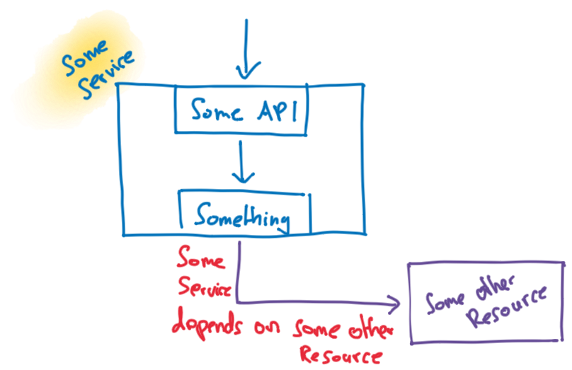
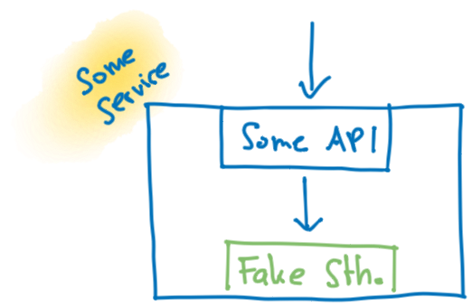

= Raketeneinhorn Spring Boot Fakeservice Demo

A small project showing how to automatically create a second standalone version of a Spring Boot service replacing
parts of the service with fake code to eliminate dependencies on external resources.

== Motivation

Often a service has a dependency on another resource (other service, database, …) which it needs to be fully functional:

So it can be cumbersome to use the service with dependencies (a so called "coupled" service) in setup where the service
itself is a resource required by another service.

To address this problem a second service eliminating the dependencies can be automatically created by replacing the code
that uses the dependencies with fake code that does not contain any dependencies, effectively creating a standalone
version of the service.

ifdef::env-github[]
++++

    

++++
endif::[]

ifndef::env-github[]

endif::[]

WARNING: This standalone service can be used for fast tests or as a local resource. As the fake service does not run the
same code as the service meant to be used in production this productive service has to be thoroughly tested, e.g. using
integrative testing.

== License

Raketeneinhorn Spring Boot Fakeservice demo is Open Source software released under the
https://www.apache.org/licenses/LICENSE-2.0.html[Apache 2.0 license].